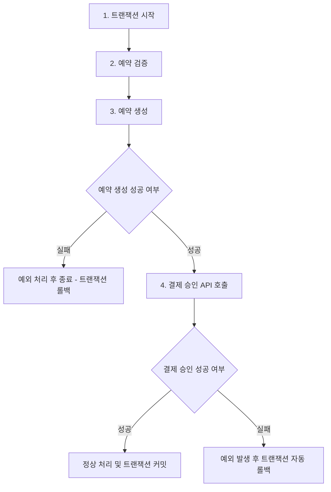

- [ ] 내 예약 페이지에서 예약 정보 외에 결제 정보도 함께 볼 수 있도록 수정
- [ ] paymentKey, 결제 금액 확인할 수 있도록
- [x] 2단계 클라이언트 코드 커밋을 참고하여 필요한 코드 추가
- [ ] 미션4 - 2단계 주석 수정

2. controller에서 서비스를 분기처리해도 될까?
- 이 기능이 하나의 트랜잭션 내에서 수행되어야 하는거 아닐까? (하나의 기능 모두가 성공하거나 실패하거나)
2. service에서 분기 처리를 해서, 서비스가 서비스를 의존해도 될까 ?

원자성을 가져야한다.
1. 결제 승인 api 호출
   1. 만약 결제가 성공한다면 예약 저장
     1. 만약 예약이 성공적으로 저장된다면 정상 응답
     2. 만약 예약 저장이 실패한다면 실패 응답 및 결제 취소 api 호출
        1. 결제 취소 api 호출 실패한다면, 유저에게 상황 + 토스 고객센터 안내 후 종료
        2. 결제 취소 api 호출 성공 시, 유저에게 상황 안내 후 종료
   2. 만약 결제가 실패한다면 예약 중단

1. 트랜잭션 시작
2. 예약 검증
3. 예약 생성
   3-1. 예약 생성 실패 시 예외 처리 후 종료
4. 결제 승인 API 호출
   4-1. 만약, API가 성공한다면, 정상 처리
   4-2. 만약, API가 실패한다면, 예외 발생 후 트랜잭션 자동 롤백

